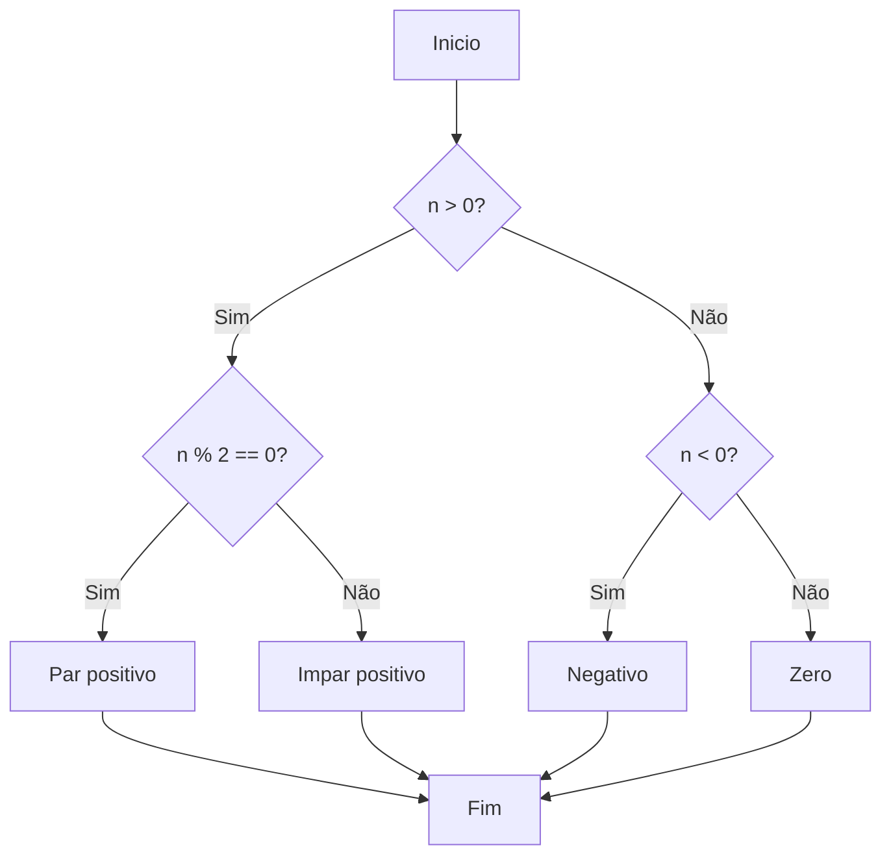
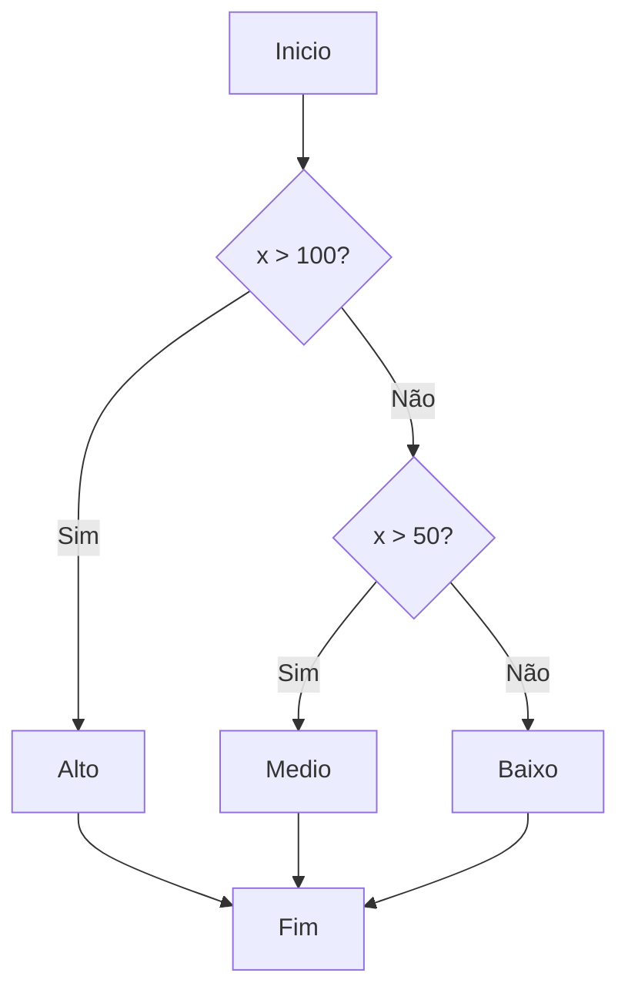
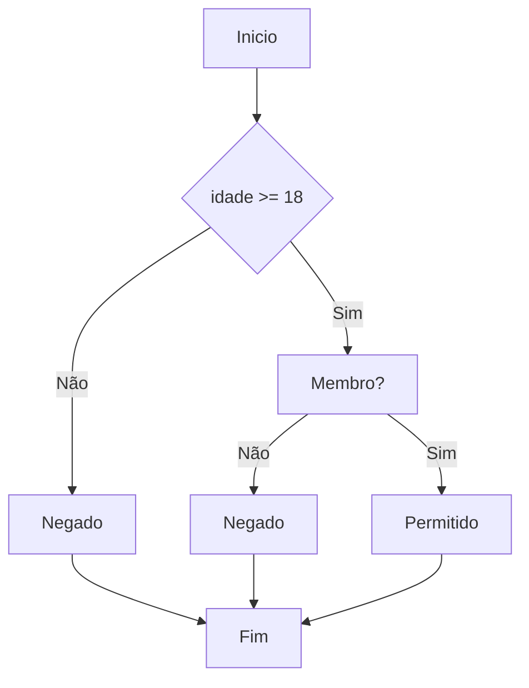
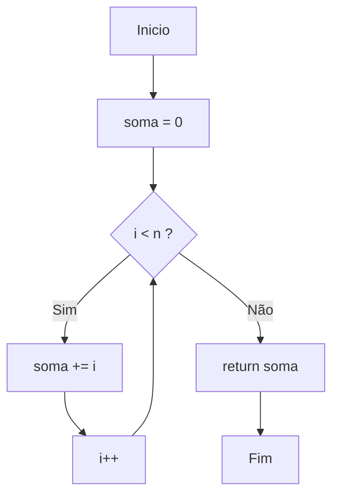

# SimulacaoTesteSoftware

# Atividade 4 — Técnicas de Caixa Branca

Disciplina: Simulação e Teste de Software  

---

# Exercício 1 — Caminhos Independentes

## Código

    def verificar(n):
        if n > 0:
            if n % 2 == 0:
                return "Par positivo"
            else:
                return "Impar positivo"
        elif n < 0:
            return "Negativo"
        else:
            return "Zero"

---

## Grafo de Fluxo de Controle


---

## Complexidade Ciclomática

Decisões:

- n > 0
- n % 2 == 0
- n < 0

    V(G) = decisões + 1
    V(G) = 3 + 1
    V(G) = 4

---

## Caminhos Independentes

1. n > 0 → n % 2 == 0 → Par positivo  
2. n > 0 → n % 2 != 0 → Impar positivo  
3. n ≤ 0 → n < 0 → Negativo  
4. n ≤ 0 → n ≥ 0 → Zero  

---

## Casos de Teste

| CT | Entrada | Saída Esperada |
|----|--------|---------------|
| CT1 | n = 4 | Par positivo |
| CT2 | n = 3 | Impar positivo |
| CT3 | n = -2 | Negativo |
| CT4 | n = 0 | Zero |

---

# Exercício 2 — Cobertura de Comandos e Ramos

## Código

    def classificar(x):
        if x > 100:
            return "Alto"
        if x > 50:
            return "Medio"
        return "Baixo"

---

## Grafo de Fluxo


---

## Complexidade Ciclomática

    Decisões = 2
    V(G) = decisões + 1
    V(G) = 2 + 1
    V(G) = 3

---

## Caminhos Independentes

1. x > 100 → Alto  
2. x ≤ 100 → x > 50 → Medio  
3. x ≤ 100 → x ≤ 50 → Baixo  

---

## Casos de Teste

### Cobertura de Comandos (C0)

| CT | x | Resultado |
|---|---|---|
| CT1 | 120 | Alto |
| CT2 | 70 | Medio |
| CT3 | 30 | Baixo |

---

### Cobertura de Ramos (C1)

| CT | x | Caminho |
|---|---|---|
| CT1 | 120 | x > 100 |
| CT2 | 70 | x ≤ 100 e x > 50 |
| CT3 | 30 | x ≤ 100 e x ≤ 50 |

    Número mínimo de testes = V(G) = 3

---

# Exercício 3 — Cobertura de Condição

## Código

    def acesso(idade, membro):
        if idade >= 18 and membro:
            return "Permitido"
        return "Negado"

---

## Grafo de Fluxo


---

## Complexidade Ciclomática

    V(G) = decisões + 1
    V(G) = 1 + 1
    V(G) = 2

---

## Caminhos Independentes

1. Condição verdadeira → Permitido  
2. Condição falsa → Negado  

---

## Cobertura de Condição (CC)

| CT | idade | membro | idade>=18 | membro | Resultado |
|----|------|-------|----------|--------|-----------|
| CT1 | 20 | True | V | V | Permitido |
| CT2 | 20 | False | V | F | Negado |
| CT3 | 16 | True | F | V | Negado |
| CT4 | 16 | False | F | F | Negado |

---

# Exercício 4 — Teste de Ciclo

## Código

    def somar_ate(n):
        soma = 0
        for i in range(n):
            soma += i
        return soma

---

## Grafo de Fluxo


---

## Complexidade Ciclomática

    1 decisão (loop)
    V(G) = 1 + 1
    V(G) = 2

---

## Casos de Teste

| Caso | Entrada | Saída |
|-----|-------|------|
| Laço ignorado | n = 0 | 0 |
| 1 iteração | n = 1 | 0 |
| várias iterações | n = 3 | 3 |

---

# Exercício 5 — Ciclo Aninhado

## Código

    def percorrer_matriz(m, n):
        for i in range(m):
            for j in range(n):
                print(f"Posicao ({i}, {j})")

---

## Grafo de Fluxo

```mermaid
    flowchart TD
    A[Inicio] --> B{i < m ?}
    B -- Sim --> C{j < n ?}
    C -- Sim --> D[print(i,j)]
    D --> E[j++]
    E --> C
    C -- Não --> F[i++]
    F --> B
    B -- Não --> G[Fim]
```
---

## Casos de Teste

| Cenário | m | n | Prints |
|-------|---|---|------|
| Ambos ignorados | 0 | 0 | 0 |
| Apenas j ignorado | 3 | 0 | 0 |
| Um executa 1 vez | 1 | 3 | 3 |
| Ambos várias vezes | 3 | 3 | 9 |

---

# Exercício 6 — Teste Integrador

### Código analisado

```python
def analisar(numeros):
    total = 0
    for n in numeros:
        if n > 0 and n % 2 == 0:
            total += n
        elif n < 0:
            total -= 1
        else:
            continue
    if total > 10:
        return "Acima"
    return "Abaixo"
```

---

# GFC

```mermaid
flowchart TD

A[Inicio] --> B[total = 0]

B --> C{for n in numeros}

C -->|lista vazia| H{total > 10}

C -->|iteracao| D{n > 0 and n % 2 == 0}

D -->|Sim| E[total += n]
D -->|Nao| F{n < 0}

F -->|Sim| G[total -= 1]
F -->|Nao| I[continue]

E --> C
G --> C
I --> C

H -->|Sim| J[return "Acima"]
H -->|Nao| K[return "Abaixo"]
```

---

# Complexidade Ciclomática

1. `for`
2. `if n > 0 and n % 2 == 0`
3. `elif n < 0`
4. `if total > 10`

```
V(G) = 4 + 1 = 5
```

**Complexidade ciclomática = 5**

---

# Caminhos Independentes

### Caminho 1 
```
Inicio → total=0 → for não executa → total>10? → return "Abaixo"
```

---

### Caminho 2 
```
Inicio → loop → condição verdadeira → total += n → volta loop → decisão final
```

---

### Caminho 3 
```
Inicio → loop → primeira condição falsa → n<0 verdadeiro → total -=1 → loop
```

---

### Caminho 4 
```
Inicio → loop → n>0 par falso → n<0 falso → continue → loop
```

---

### Caminho 5 
```
Inicio → loop somando pares positivos → total > 10 → return "Acima"
```

---

# Casos de Teste

| Caso | Entrada | Execução | Resultado Esperado |
|----|----|----|----|
| CT1 | `[]` | laço 0 vezes | `"Abaixo"` |
| CT2 | `[2]` | soma par positivo | `"Abaixo"` |
| CT3 | `[-1]` | executa ramo negativo | `"Abaixo"` |
| CT4 | `[3]` | executa `continue` | `"Abaixo"` |
| CT5 | `[4,4,4]` | soma = 12 | `"Acima"` |

---

# Cobertura de Comandos (C0)

Todos os comandos executados:

- `total += n`
- `total -= 1`
- `continue`
- `return "Acima"`
- `return "Abaixo"`

Os **5 casos de teste acima cobrem todos os comandos**.

---

# Cobertura de Ramos (C1)

1. `n > 0 and n % 2 == 0` → verdadeiro e falso  
2. `n < 0` → verdadeiro e falso  
3. `total > 10` → verdadeiro e falso  

Os testes:

```
CT2, CT3, CT4, CT5
```

---

# Cobertura de Condição (CC)

Condições da expressão:

```
n > 0
n % 2 == 0
```

Combinações:

| n | n>0 | n%2==0 |
|---|---|---|
| 2 | T | T |
| 3 | T | F |
| -1 | F | F |

Casos utilizados:

```
[2], [3], [-1]
```

---

# Comportamento do Laço

| Caso | Entrada | Iterações |
|----|----|----|
| 0 iterações | `[]` | 0 |
| 1 iteração | `[2]` | 1 |
| várias | `[4,4,4]` | 3 |

---

# 9. Pares Def-Uso da variável `total`

Definições:

```
total = 0
total += n
total -= 1
```

Usos:

```
if total > 10
return total (valor usado para decisão)
```

Pares Def-Uso:

```
(total=0 → total>10)
(total+=n → total>10)
(total-=1 → total>10)
```

# Exercício 7 — Fluxo de Dados

## Código

    def desconto(preco, cliente_vip):
        total = preco
        if cliente_vip:
            desconto = preco * 0.2
            total = preco - desconto
        if total < 50:
            total = 50
        return total

---

## Pares Def-Uso

| Variável | Def → Uso |
|--------|-----------|
| preco | param → linha2 |
| preco | param → linha4 |
| desconto | linha4 → linha5 |
| total | linha2 → linha6 |
| total | linha5 → linha6 |
| total | linha7 → linha8 |

---

## Casos de Teste

### All-Defs

| CT | preco | vip |
|----|------|-----|
| CT1 | 100 | True |

### All-Uses

| CT | preco | vip |
|----|------|-----|
| CT1 | 100 | True |
| CT2 | 30 | False |

---

